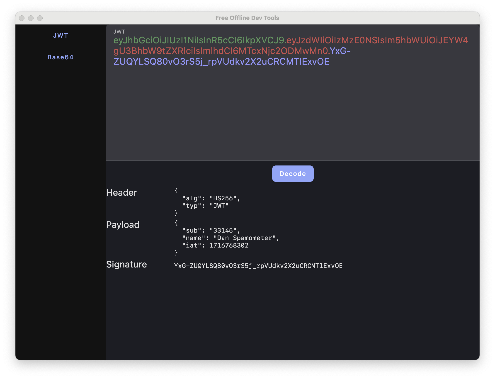

<h2 align="center"> Free Offline Dev Tools</h2>



## Intro
A collection of developer tools that are 100% offline with no tracking / network connectivity at all. Made with 
[Compose for Desktop](https://www.jetbrains.com/lp/compose-desktop/). Currently supported tools are JWT and base64 
but there are more to come soon such as dates, more encodings and escaping.

## Installation and running

For now clone this repo, make sure you have Java 21 installed and run
```
./gradlew run
```
